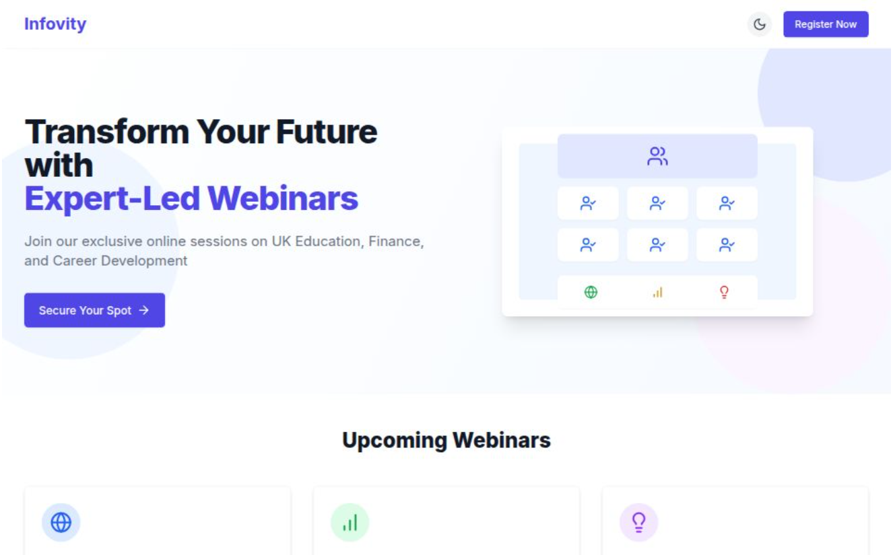

# Infovity Webinar Registration Platform

A modern, responsive webinar registration system built with Next.js, TypeScript, and MongoDB. This application allows users to register for educational webinars with a sleek interface that includes dark mode support and mobile responsiveness.



## Features

- **Seamless Registration Flow**: Easy-to-use form for webinar registration
- **Multiple Webinar Topics**: Support for various webinar topics with individual details
- **Dark/Light Mode Toggle**: User-selectable theme preference
- **Responsive Design**: Optimized for all device sizes
- **Server-Side Data Validation**: Ensures data integrity
- **MongoDB Integration**: Secure data storage with MongoDB Atlas
- **Enhanced Thank You Page**: Detailed confirmation with webinar information
- **API Routes**: Built-in API using Next.js API routes

## Tech Stack

- **Next.js 14**: React framework with server-side rendering
- **TypeScript**: Type-safe JavaScript
- **MongoDB**: NoSQL database for registration data
- **Tailwind CSS**: Utility-first CSS framework
- **Lucide React**: Beautiful SVG icons

## Getting Started

### Prerequisites

- Node.js 18.x or higher
- npm 8.x or higher
- MongoDB Atlas account (free tier works fine)

### Installation

1. Clone the repository:
   ```bash
   git clone https://github.com/your-username/infovity-webinar.git
   cd infovity-webinar
   ```

2. Install dependencies:
   ```bash
   npm install
   ```

3. Create a `.env.local` file in the project root:
   ```
   MONGODB_URI=mongodb+srv://<username>:<password>@<cluster>.mongodb.net/<database>
   NEXT_PUBLIC_API_URL=http://localhost:3000
   NEXT_PUBLIC_FRONTEND_URL=http://localhost:3000
   ```
   
4. Start the development server:
   ```bash
   npm run dev
   ```

The application will be available at `http://localhost:3000`.

## Project Structure

```
infovity-webinar/
├── public/               # Static assets
├── src/
│   ├── app/              # Next.js App Router
│   │   ├── api/          # API routes
│   │   │   └── register/ # Registration API
│   │   ├── globals.css   # Global styles
│   │   ├── layout.tsx    # Root layout
│   │   └── page.tsx      # Home page
│   ├── components/       # React components
│   │   └── InfovityLandingPage.tsx # Main landing page component
│   ├── lib/              # Utility functions
│   │   └── mongodb.ts    # MongoDB connection
│   └── models/           # Data models
│       └── registration.ts # Registration model and validation
├── .env.local            # Environment variables (not in repo)
├── next.config.js        # Next.js configuration
├── package.json          # Dependencies and scripts
├── tailwind.config.ts    # Tailwind CSS configuration
└── tsconfig.json         # TypeScript configuration
```

## Environment Variables

| Variable | Description |
|----------|-------------|
| `MONGODB_URI` | MongoDB connection string |
| `NEXT_PUBLIC_API_URL` | URL for the API (same as app URL in production) |
| `NEXT_PUBLIC_FRONTEND_URL` | Frontend URL for CORS settings |

## Deployment

### Deploying to Vercel

1. Push your code to a GitHub repository
2. Import the project in the Vercel dashboard
3. Add the environment variables in the Vercel project settings
4. Deploy!

### Other Deployment Options

- **Manual Deployment**: Build the project with `npm run build` and start with `npm start`
- **Docker**: A Dockerfile is provided for containerized deployment

## Customization

### Adding New Webinar Topics

Edit the `webinarTopics` object in `src/models/registration.ts`:

```typescript
export const webinarTopics = {
  'new-topic-id': {
    title: 'New Webinar Topic',
    date: 'June 1, 2025',
    time: '7:00 PM IST'
  },
  // ...existing topics
};
```

### Styling

The project uses Tailwind CSS for styling. You can customize the design by:

1. Modifying `tailwind.config.ts` for theme colors, fonts, etc.
2. Adding custom styles in `src/app/globals.css`

## Admin Interface

Plans for future releases include an admin interface for:
- Viewing and managing registrations
- Exporting registration data to CSV
- Sending email reminders to registrants
- Analytics dashboard

## Contributing

Contributions are welcome! Please feel free to submit a Pull Request.

1. Fork the repository
2. Create your feature branch (`git checkout -b feature/amazing-feature`)
3. Commit your changes (`git commit -m 'Add some amazing feature'`)
4. Push to the branch (`git push origin feature/amazing-feature`)
5. Open a Pull Request

## License

This project is licensed under the MIT License - see the LICENSE file for details.

## Acknowledgements

- [Next.js](https://nextjs.org/)
- [MongoDB](https://www.mongodb.com/)
- [Tailwind CSS](https://tailwindcss.com/)
- [Lucide Icons](https://lucide.dev/)